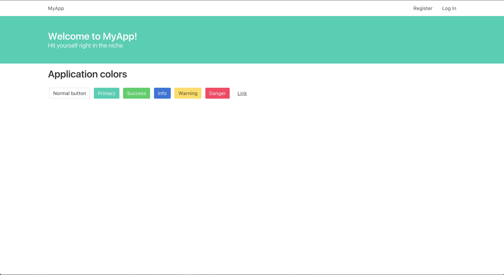
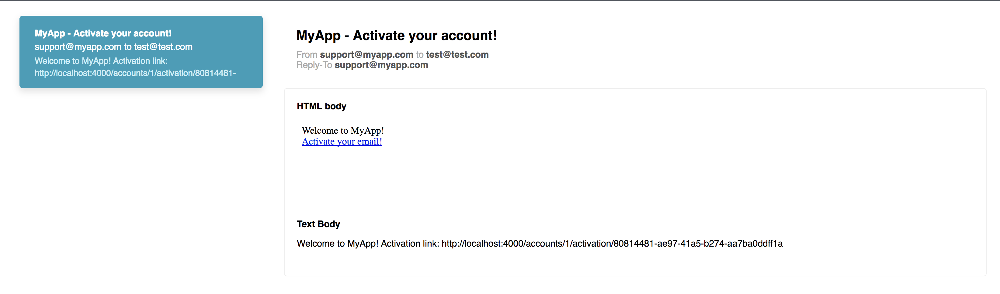

Phoenix Starter
===============

Open source starter project for Phoenix framework. This is a slightly modified default Phoenix setup with the addition of webpack and yarn for frontend asset management rather than brunch. It also includes a basic user registration module covering common cases like user activation and forgotten passwords.

### Libraries included

#### Elixir:
- [Phoenix Framework](http://phoenixframework.org/)
- [HTTPoison](https://github.com/edgurgel/httpoison)
- [UUID](https://github.com/zyro/elixir-uuid)
- [Timex](https://github.com/bitwalker/timex)
- [Credo](https://github.com/rrrene/credo)
- [Bamboo](https://github.com/thoughtbot/bamboo)
- [Comeonin](https://github.com/riverrun/comeonin)
- [Bcrypt Elixir](https://github.com/riverrun/bcrypt_elixir)
- [Guardian](https://github.com/ueberauth/guardian)

Front end:
- [Bulma](http://bulma.io/)
- [Yarn](https://yarnpkg.com/en/)
- [Webpack](https://webpack.js.org/)
- [Babel](https://babeljs.io/)
- [PostCSS](https://github.com/postcss/postcss)
- [SASS](http://sass-lang.com/)

### Variations

The [turbolinks](https://github.com/awestbro/phoenix-starter/tree/turbolinks) branch contains a setup for turbolinks and stimiulusjs. 

### Installation

Tested with:
- Erlang/OTP `21`
- Elixir `1.6.6`
- Yarn `1.7.0`

To start your Phoenix server:

  * Install dependencies with `mix deps.get`
  * Create and migrate your database with `mix ecto.create && mix ecto.migrate`
  * Install Node.js dependencies with `cd assets && yarn install`
  * Start Phoenix endpoint with `mix phx.server`

Now you can visit [`localhost:4000`](http://localhost:4000) from your browser.

### Make it your own!

To make this app your own, do a case-sensitive find/ replace in this folder for MyApp => NewName and myapp => newname. You will also have to replace two folder structures under `lib/myapp*` and `test/myapp*`

### Development

I love development in Elixir and Phoenix. Well thought out libraries help you iterate on ideas quickly and safely with beautiful helper functions.

One of my favorite tools is the Bamboo development plugin which lets you send and view emails on a development server without actually sending the emails:

### Deployment

I personally use [Gitlab](https://gitlab.com/) for deploying personal private projects. Therefore there's an included `gitlab-ci.yml` file with an example of how to test/ build/ deploy in a CI/CD environment. If you're using CircleCI/ Travis/ whatever just copy install steps from there into their format.

This project does rely on some environment variables for api keys etc. So you will need to supply your application with the following environment variables at runtime:

- DATABASE_URL
- GUARDIAN_SECRET
- MAILGUN_API_KEY
- POOL_SIZE
- SECRET_KEY_BASE

Check the `config/prod.exs`

I use heroku at the moment for deployment, for other deployment options [check out phoenix deployment guides](http://www.phoenixframework.org/docs/deployment).

### Learn more about Phoenix

  * Official website: http://www.phoenixframework.org/
  * Guides: http://phoenixframework.org/docs/overview
  * Docs: https://hexdocs.pm/phoenix
  * Mailing list: http://groups.google.com/group/phoenix-talk
  * Source: https://github.com/phoenixframework/phoenix
